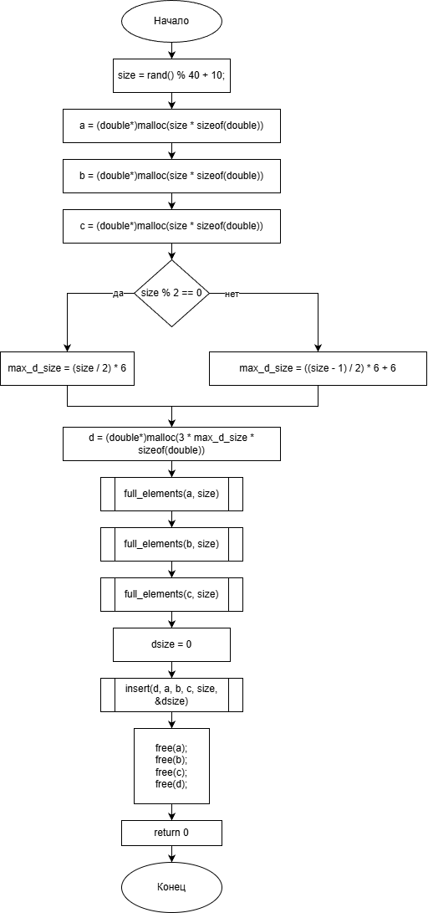
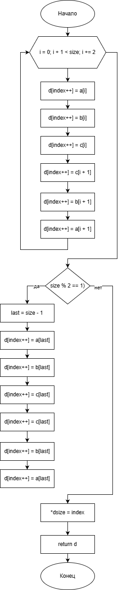

# Домашнее задание

## Условие задачи
**Генерация и обработка трех массивов со случайными числами**

Сгенерировать три массива со случайными вещественными числами a₀, a₁, a₂, ..., aₙ, b₀, b₁, b₂ ..., bₘ, c₀, c₁, c₂, ..., cₗ, количество элементов случайно в интервале от 10 до 50. Реализовать функцию, которая возвращает новый массив. Все 4 массива вывести на экран.


## 1. Алгоритм и блок-схема

### Алгоритм
1. **Начало**
2. Инициализировать генератор случайных чисел
3. Сгенерировать случайный размер массивов в диапазоне 10-50
4. Выделить динамическую память для трех массивов: A, B, C
5. Вычислить максимальный возможный размер результирующего массива D
6. Заполнить массивы A, B, C случайными вещественными числами:
   - Числа в диапазоне от 0 до 100
7. Создать массив D путем вставки элементов по определенному правилу:
   - Использовать функцию `insert()`
   - Для каждой пары элементов из A, B, C:
     - Взять элементы A[i], B[i], C[i]
     - Добавить в D в порядке: A[i], B[i], C[i], C[i+1], B[i+1], A[i+1]
8. Вывести все 4 массива в табличном формате:
   - Использовать функцию `put_elements()`
   - Отображать массивы A, B, C, D в колонках
9. Освободить выделенную память
10. **Конец**

### Блок-схема алгоритма
- main() <br>
 <br>
- insert <br>
 <br>

[https://github.com/glebofrl/lab16VSTU/blob/master/scheme1.png](https://github.com/glebofrl/lab16VSTU/blob/master/scheme1.png)
[https://github.com/glebofrl/lab16VSTU/blob/master/scheme2.png](https://github.com/glebofrl/lab16VSTU/blob/master/scheme2.png)

## 2. Реализация программы

```
#include <locale.h>
#include <stdio.h>
#include <stdlib.h>
#include <math.h>
#include <time.h>

double* full_elements(double* ptr_array, int n) {
    for (int i = 0; i < n; i++) {
        double r = (double)rand() / RAND_MAX;
        ptr_array[i] = r * 100.0;
    }
    return ptr_array;
}


void put_elements(double* d, double* a, double* b, double* c, int size, int dsize) {
    printf("Массив A\tМассив B\tМассив C\tМассив D\n");
    printf("--------------------------------------------------------\n");

    for (int i = 0; i < size; i++) {
        printf("%8.2lf\t%8.2lf\t%8.2lf\t%8.2lf\n", a[i], b[i], c[i], d[i]);
    }
    for (int i = size; i < dsize; i++) {
        printf("\t\t\t\t\t\t%8.2lf\n", d[i]);
    }
}

double* insert(double* d, double* a, double* b, double* c, int size, int* dsize) {
    int index = 0;
    for (int i = 0; i + 1 < size; i += 2) {
        d[index++] = a[i];
        d[index++] = b[i];
        d[index++] = c[i];
        d[index++] = c[i + 1];
        d[index++] = b[i + 1];
        d[index++] = a[i + 1];
    }
    if (size % 2 == 1) {
        int last = size - 1;
        d[index++] = a[last];
        d[index++] = b[last];
        d[index++] = c[last];
        d[index++] = c[last];
        d[index++] = b[last];
        d[index++] = a[last];
    }
    *dsize = index;
    return d;
}

int main() {
    setlocale(LC_ALL, "RUS");
    srand(time(NULL));
        int size = rand() % 40 + 10;    
        double* a;
        double* b;
        double* c;
        double* d;


        a = (double*)malloc(size * sizeof(double));
        b = (double*)malloc(size * sizeof(double));
        c = (double*)malloc(size * sizeof(double));

        int max_d_size;
        if (size % 2 == 0) {
            max_d_size = (size / 2) * 6;
        }
        else {
            max_d_size = ((size - 1) / 2) * 6 + 6;
        }
        d = (double*)malloc(3 * max_d_size * sizeof(double));

        full_elements(a, size);
        full_elements(b, size);
        full_elements(c, size);

        int dsize = 0;
        insert(d, a, b, c, size, &dsize);
        put_elements(d, a, b, c, size, dsize);

        free(a);
        free(b);
        free(c);
        free(d);
    system("pause");
    return 0;
}
```

## 3. Результаты работы программы


## 4. Информация о разработчике

Глебов Илья, бИПТ-252
